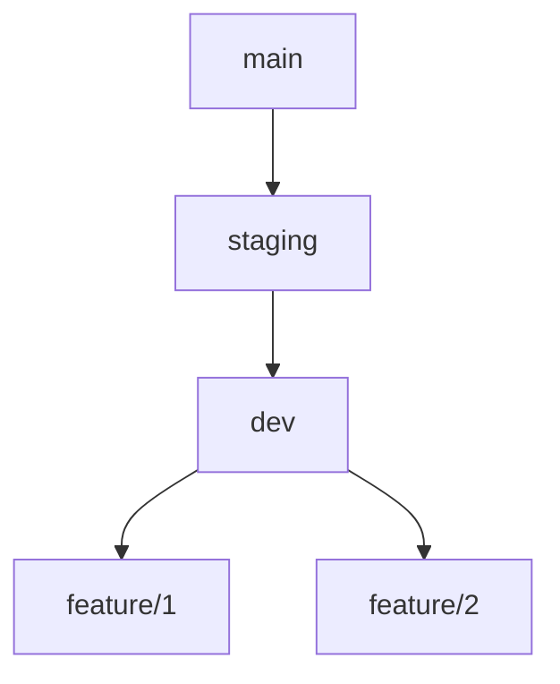
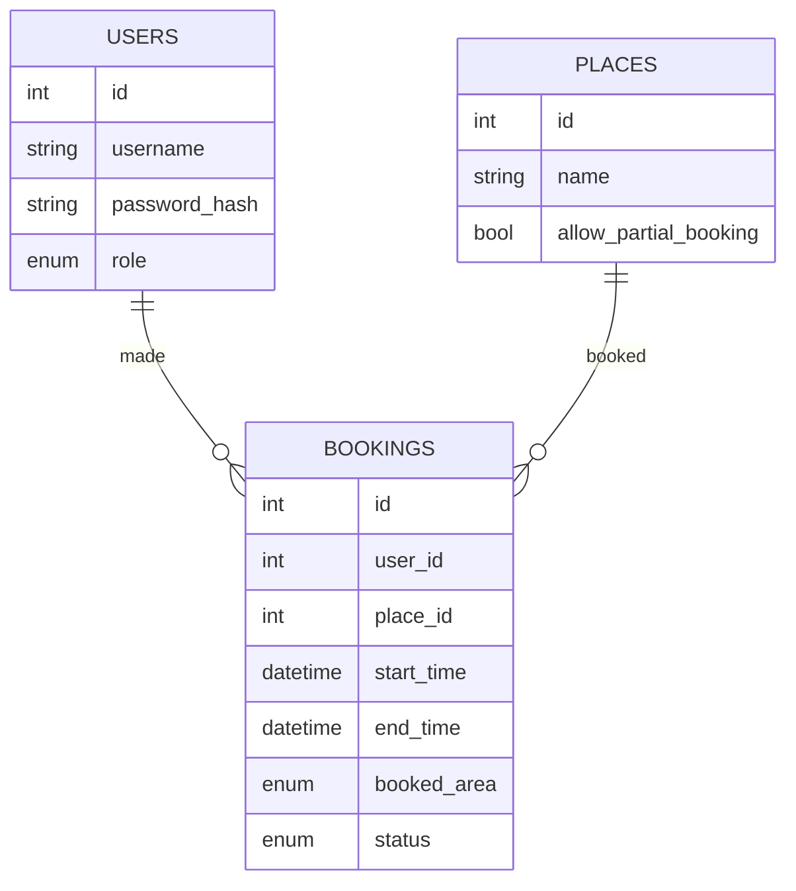

# Sjenk - Booking System Specification

- [Sjenk - Booking System Specification](#sjenk---booking-system-specification)
  - [1. Project Overview](#1-project-overview)
  - [2. Repository Structure](#2-repository-structure)
  - [2. Data Model (SQLite)](#2-data-model-sqlite)
    - [**Users Table**](#users-table)
    - [**Places Table**](#places-table)
    - [**Bookings Table**](#bookings-table)
    - [**Booking Rules \& Conflict Management**](#booking-rules--conflict-management)
  - [3. API Endpoints (FastAPI)](#3-api-endpoints-fastapi)
    - [**Authentication**](#authentication)
    - [**Places Management**](#places-management)
    - [**Booking Management**](#booking-management)
  - [4. Frontend Structure](#4-frontend-structure)
    - [**Option 1: Jinja2 (Server-rendered)**](#option-1-jinja2-server-rendered)
    - [**Option 2: JavaScript (SPA)**](#option-2-javascript-spa)
  - [5. System Workflow](#5-system-workflow)

## 1. Project Overview

**Name:** Sjenk
**Description:** A web-based booking system for managing time slots at various locations (e.g., football fields, gyms).
**Technology Stack:**

- **Backend:** FastAPI (Python)
- **Database:** SQLite
- **Frontend:** Jinja2 (server-rendered) or JavaScript (dynamic frontend)
- **Authentication:** OAuth2 with JWT (JSON Web Tokens) or session-based authentication

- **Hosting:**
  - **Frontend:** Raspberry Pi
  - **Backend:** Raspberry Pi
  - **Database:** SQLite on Raspberry Pi

---

## 2. Repository Structure

```plaintext
sjenk/
├── backend/          # FastAPI backend
│   ├── app/         # FastAPI app
│   ├── db/          # SQLite database
│   ├── tests/       # Unit tests
│   └── main.py      # Main FastAPI app
├── frontend/         # Frontend (Jinja2/JS)
│   ├── static/      # Static files (CSS, JS)
│   ├── templates/   # Jinja2 templates
│   └── main.py      # Main Flask app
└── README.md        # Project overview
```

Branching strategy: `main` (production), `staging` (testing), `dev` (development), `feature/*` (feature branches)



## 2. Data Model (SQLite)

### **Users Table**

| Column          | Type                                         | Description     |
| --------------- | -------------------------------------------- | --------------- |
| `id`            | PK, int, autoincrement                       | Unique user ID  |
| `username`      | str, unique                                  | Username        |
| `password_hash` | str                                          | Hashed password |
| `role`          | enum(`admin`, `leader`, `organizer`, `user`) | User role       |

### **Places Table**

| Column                  | Type                   | Description                                |
| ----------------------- | ---------------------- | ------------------------------------------ |
| `id`                    | PK, int, autoincrement | Unique place ID                            |
| `name`                  | str, unique            | Name of the place (e.g., "Football Field") |
| `allow_partial_booking` | bool                   | Whether partial booking is allowed         |

### **Bookings Table**

| Column        | Type                                     | Description               |
| ------------- | ---------------------------------------- | ------------------------- |
| `id`          | PK, int, autoincrement                   | Unique booking ID         |
| `user_id`     | FK, int, references `users.id`           | User who made the booking |
| `place_id`    | FK, int, references `places.id`          | The booked location       |
| `start_time`  | datetime                                 | Start time                |
| `end_time`    | datetime                                 | End time                  |
| `booked_area` | enum(`full`, `half`, `quarter`)          | Amount of space booked    |
| `status`      | enum(`confirmed`, `pending`, `canceled`) | Booking status            |



### **Booking Rules & Conflict Management**

- If **full field** is booked → No other bookings allowed
- If **half field** is booked → Only the other half or two quarters can be booked
- If **quarter field** is booked → Three other quarters can still be booked

---

## 3. API Endpoints (FastAPI)

### **Authentication**

| Method   | Endpoint         | Description                       | Access |
| -------- | ---------------- | --------------------------------- | ------ |
| **POST** | `/auth/login`    | Returns JWT token or sets session | All    |
| **POST** | `/auth/register` | Registers a new user (admin only) | Admin  |

### **Places Management**

| Method   | Endpoint  | Description          | Access |
| -------- | --------- | -------------------- | ------ |
| **GET**  | `/places` | Fetch list of places | All    |
| **POST** | `/places` | Create a new place   | Admin  |

### **Booking Management**

| Method     | Endpoint         | Description                                   | Access                   |
| ---------- | ---------------- | --------------------------------------------- | ------------------------ |
| **GET**    | `/bookings`      | Fetch all bookings                            | All                      |
| **POST**   | `/bookings`      | Create a new booking (validates availability) | Organizer, Leader, Admin |
| **DELETE** | `/bookings/{id}` | Delete a booking                              | Leader, Admin            |
| **PATCH**  | `/bookings/{id}` | Modify (override) a booking                   | Leader, Admin            |

---

## 4. Frontend Structure

### **Option 1: Jinja2 (Server-rendered)**

- Backend serves HTML templates using Jinja2
- AJAX with JavaScript for dynamic updates

**Pages:**

- `index.html` → Overview of places
- `login.html` → Login page
- `dashboard.html` → User dashboard

### **Option 2: JavaScript (SPA)**

- Frontend built with Vanilla JS / React / Vue
- Communication via REST API (fetch/Axios)
- JWT-based authentication

---

## 5. System Workflow

1. **Role logs in** (JWT/session)
2. **Role selects location** to interact with
3. **Role views bookings** for the selected location
4. **Role creates a booking** (if allowed)
5. **Role modifies/deletes a booking** (if allowed)
6. **Administrator manages users, places, and bookings**
7. **Conflict management** ensures no overlapping bookings
8. **Role logs out**

---

This document serves as the technical specification for the Sjenk booking system.
